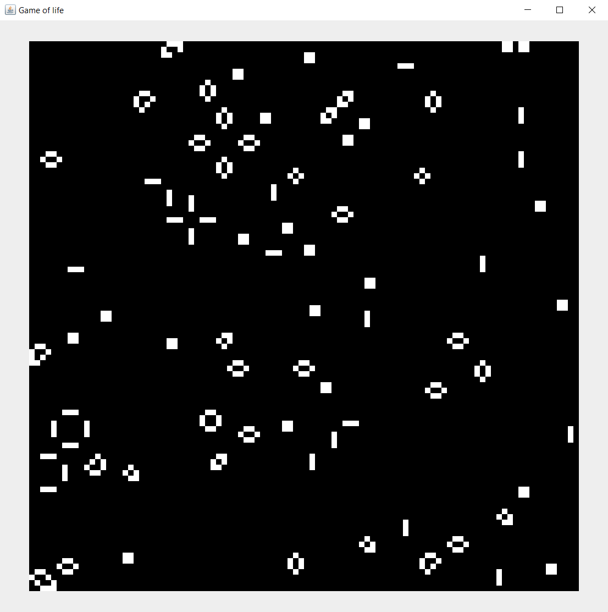

# GameOfLife

  
  Program that simulates Conway's game of life.
 
    
  
  The rules of the game are simple: A grid (called the "world" of the game) is randomly generated with the cells being either alive or dead. Based on this initial state, the world can then evoluate through multiple generations, with each cell changing based on the state of its adjacent cells, also called neighbors. The rules are the following:  
  1- Any living cell with fewer than two live neighbors dies, as if caused by under population 
  2- Any living cell with two or three live neighbors lives on to the next generation 
  3- Any living cell with more than three live neighbors dies, as if by overpopulation 
  4- Any dead cell with exactly three live neighbors becomes a live cell, as if by reproduction 
  More about this at https://en.wikipedia.org/wiki/Conway%27s_Game_of_Life  
  
  To launch the game, open the Main class, modify the parameters at the top as necessary (Colors of the cells / Refresh rate / Proportion of alive cells in the initial state...) and run its main method. 
  
  
 

